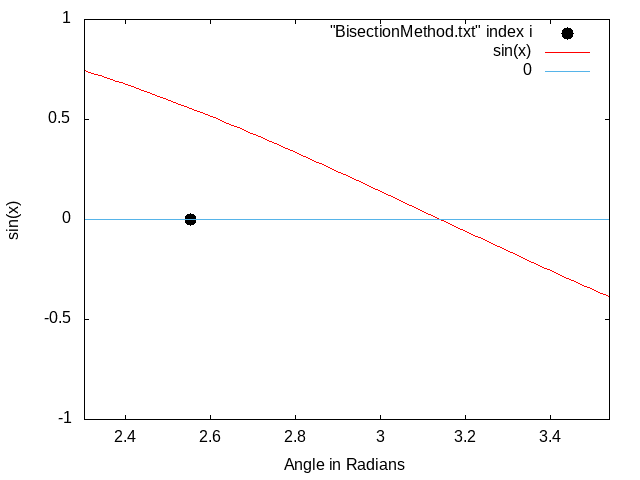

# Numerical-Analysis-Using-C++
This repository contains codes of Numerical Methods in c++ which re used to solve different mathematical problems like finding roots of a function, solving differential equations, integration, etc. Which are then visualized with the help of gnuplot.

# Table Of Contents 
  * [Libraries Used](#libraries-used)
  * [Usage](#usage)
  * [Finding Roots Of Functions](#finding-roots-of-functions)
    * [Bisection Method](#bisection-method)
  * [License](#license)
    
# Libraries Used
1) cmath(for using mathematical constants like pi)
2) iostream(for input/output)
3) math.h(for using mathematical functions like abs(),sin(),etc.)
4) fstream(for input/output to files)
5) iomanip(for setting prescision to )

# Usage

Most of the libraries used are installed bydefault while installing c++ compilers, check wether the libraries are present on your device. Install gnuplot if you want to generate the gifs and graphs, otherwise you can use any other tool for graphical visualization.

**Note:** Don't forget to set the working directory to the folder that contains the code as the data for visualization is imported using relative paths.

# Finding Roots Of Functions
For finding roots of a function[f(x)], we need to find the intersection of function with the x axis i.e when f(x) = 0. At every step of solution , we write the value of x in a text file, which is later plotted with the help of gnuplot and the code for the same can be found in the Text files.

## Bisection Method

In bisection method, we have to enter boundaries in which suspect the root to be along with the accuracy(eta) till which we want the root. We are also required to enter a another paramter(delta) which tells minumum deflection in f(x) between consecutive steps .for eg if we select f(x)= sin(x) and we put boundaries (pi/2, 7*pi/4), eta = 0.0000001, delta = 0.0000001  ,we know that sinx has root in this range at x = 3.141592653589793 ,after running the code we get root at x = 3.14159256 which is accurate till 6 decimals which takes 23 steps. In the gif below we can see how the  solution from the algorithm moves closer and closer to real root. For more information about algorithm click [here](https://en.wikipedia.org/wiki/Bisection_method).
  &nbsp; &nbsp; &nbsp;
<a>
The curve in red is the original equation, the black point is the solution obtained from the algorithm, the line in blue is the xaxis. 
Thus we can find roots of different functions, even roots for the functions whose roots are quite difficult to find on paper.
</a>
